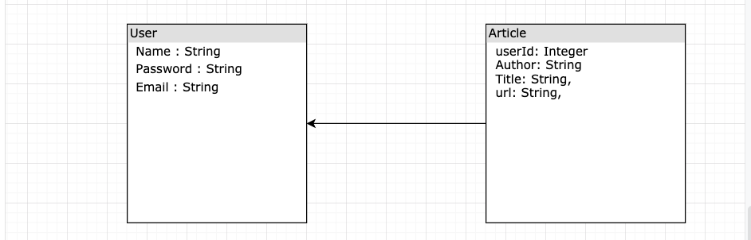
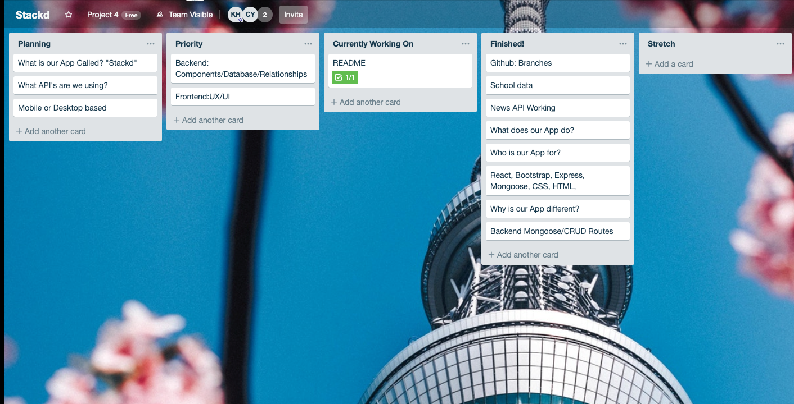

# Stackd™ 


## Developers 
- Charles Yun
- Kenneth Hong 

## Programs Used
- React.Js
- React-bootstrap
- Recharts
- fontawesome
- HTML
- CSS 
- Express
- Mongoose 
- MongoDB
- dotenv
- express
- express-jwt
- express-rate-limit
- express-form-data
- helmet
- jsonwebtoken
- News-API
- Cloudinary API
- fontawesome
- JSON 


## What is Stackd? 
- Stackd is a tech news app that allows user to create a account and access tech news articles from 3 different tech media companies. Stackd also allows users to check out what is hot in the market regarding current trends of programing languages, video game popularity, and other data. With that being said, a user can save an article to their profile as well as update his or her bio. Letting them connect with others and share what they have saved and how they are. Your all in one app for all of your tech needs. 


## User Story
- Charles loves to be up to date on the latest tech trends. He also loves to connect and share with his friends on social media. The each one teach one mentality, however;  he does not like to be bogged down by spam mail from the media sources and wants to keep track of which articles he really engaged with. With that being said, Charles downloads the app Stackd. A tech news hub app that grabs tech news from 3 different tech media companies and displays them neatly on one page. Which then he can save to his profile and connect with his friends about what he read. Charles is happy. Charles is Stackd. 


## Entity Relation Diagram 
 


## Components / Pages 
- Components
   - Used a Loading Component which displays the logo as the page loads.
   - Used a Loading Footer Component at the bottom of the page. 


- Pages
   - Signup: Registration for new users
   - Login: Login for current users
   - Home: Homepage that features a Jumbotron and top featured articles from the tech industry
   - School: Top coding bootcamps
   - Trending: Hiring and technology trends
   - Library: Links to numerous resources such as programming languages, media, and tools.
   - UserProfile: A user's profile page where the user can save articles and update their bio

## Planning 
 


## Frontend 
   - Accessing the News API 
```javascript 
   let newsApi = `https://newsapi.org/v2/everything?domains=techcrunch.com&language=en&pageSize=40&apiKey=47b1d9f9ee354c3992a16d4f94dddc69`
   axios.get(newsApi).then(response => {
      console.log(response.data.articles)
      this.setState({
         news:response.data.articles
      })
   }).catch( err => console.log(err))
}
``` 


## Backend 
   - Route for Storing Article for user 
```javascript 
router.post("/:userId/articles", (req, res) => {
   User.findById(req.params.userId).then((user, err) => {
      Article.create({
         title: req.body.title,  
         author: req.body.author,
         url: req.body.url,
         userId: req.body.userId
      }, (err,article) => {
         User.findById(req.body.userId, (err, user) => {
            user.articles.push(article);
            user.save((err, user) => {
               res.status(201).json(user);
            })
         })
      });
   })
})
```

## Routes 
| Method | Route |
|--------|-------|
| POST   | /login | 
| POST   | /signup | 
| POST   | /me/from/token | 
| POST   | /userId/articles | 
| GET    | /userId/articles | 
| PUT    | /userId | 
| DELETE | /userId/articles/:id | 


## Data Visualization 
   - Previously we had experience with React-vis, however; this time we decided to use another program called Recharts. Recharts make it easy to intergrate charts into your React application. For more information on Recharts check out www.recharts.org

```javascript 
   <Card>
                        <Card.Body>
                     <h2> React </h2> <FontAwesomeIcon className="fontAwe" size="4x" icon={['fab', 'react']} />
                        <AreaChart className="trendingBox" width={500} height={200} data={this.React} margin={{ top: 10, right: 30, left: 0, bottom: 0,}}>
                           <CartesianGrid strokeDasharray="3 3" />
                           <XAxis dataKey="name" />
                           <YAxis />
                           <Tooltip />
                           <Area type="monotone" dataKey="uv" stroke="#000" fill="#4F86F7" />
                        </AreaChart>
                        </Card.Body>
                        </Card>
                     <Card>
                        <Card.Body>
                     <h2> Python </h2> <FontAwesomeIcon className="fontAwe" size="4x" icon={['fab', 'python']} />
                        <AreaChart  className="trendingBox" width={500} height={200} data={this.Python} margin={{top: 10, right: 30, left: 0, bottom: 0, }}>
                           <CartesianGrid strokeDasharray="3 3" />
                           <XAxis dataKey="name" />
                           <YAxis />
                           <Tooltip />
                           <Area connectNulls type="monotone" dataKey="uv" stroke="#000" fill="#4F86F7" />
                        </AreaChart>
                        </Card.Body>
                     </Card>
                  </Col>
                  <Col>
                     <Card>
                        <Card.Body>
                     <h2> Javascript </h2> <FontAwesomeIcon className="fontAwe" size="4x" icon={['fab', 'js-square']} /> 
                        <AreaChart className="trendingBox"  width={500} height={200} data={this.Javascript} margin={{top: 10, right: 30, left: 0, bottom: 0, }}>
                           <CartesianGrid strokeDasharray="3 3" />
                           <XAxis dataKey="name" />
                           <YAxis />
                           <Tooltip />
                           <Area connectNulls type="monotone" dataKey="uv" stroke="#000" fill="#4F86F7" />
                        </AreaChart>
                        </Card.Body>
                     </Card>
                     <Card>
                        <Card.Body>
                     <h2> Java </h2> <FontAwesomeIcon className="fontAwe" size="4x" icon={['fab', 'java']} />
                        <AreaChart  className="trendingBox" width={500} height={200} data={this.Java} margin={{top: 10, right: 30, left: 0, bottom: 0, }}>
                           <CartesianGrid strokeDasharray="3 3" />
                           <XAxis dataKey="name" />
                           <YAxis />
                           <Tooltip />
                           <Area connectNulls type="monotone" dataKey="uv" stroke="#000" fill="#4F86F7" />
                        </AreaChart>
                           </Card.Body>
                        </Card>
```


## Design / UX / UI 
 #### Potential App Outline 


